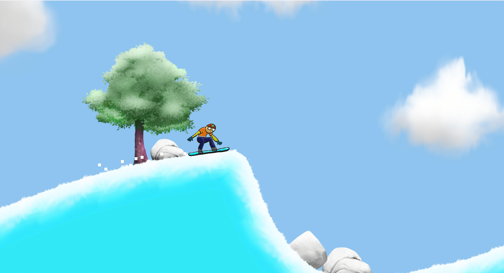

# 🏂 Snow Boarder



A physics-based 2D snowboarding game! Boost forward, flip through the air, and land smoothly — or crash with style! Enjoy the thrill with effects and sound.

---

## 🎮 Features

- **Boost & Flip Controls** — Arrow keys for speed and spin  
- **Crash Effects** — Sound and particles on player collision  
- **Win Celebration** — Visual effects and sounds on game win  
- **Smooth Physics** — Built on Unity's native 2D physics system

---

## 🕹️ Controls

| Action             | Keys           |
| ------------------ | -------------- |
| Boost Speed        | ↑ Up Arrow     |
| Flip Left          | ← Left Arrow   |
| Flip Right         | → Right Arrow  |
| Toggle Fullscreen  | Alt + Enter    |
| Exit Game          | Esc or Alt + F4|

---

## 🚀 Installation & Usage

1. **Clone the Repo**  
   ```bash
   git clone https://github.com/ASRafi41/Snow-Boarder.git
   cd Snow-Boarder
   ```

2. **In Unity Editor (2021+)**  
    - Open the project folder  
    - Go to **Edit → Project Settings → Player → Other Settings**  
    - Under **Active Input Handling**, select:  
      `Both` (or `Input System Package`)  
    - Press ▶️ Play to run the game

3. **Run Standalone Build (Windows)**  
    - Download ZIP 👉 [SnowBoarder.zip](https://drive.google.com/file/d/18O35WmagJOjL50D67OQ_qSh54bfqkwXz/view?usp=sharing)  
    - Extract the ZIP  
    - Run `SnowBoarder.exe`

4. **Watch Gameplay Demo**  
    🎥 [Demo Video](https://drive.google.com/file/d/1-beiEBRq6z4GgcvZLxOT3-Sfi4XZZvgY/view?usp=sharing)

---

## 📁 Project Structure

```
Snow-Boarder/
├─ Assets/
│  ├─ Scenes/
│  │  └─ level1.unity
│  ├─ Scripts/
│  │  ├─ CrashDetector.cs
│  │  ├─ FinishLine.cs 
│  │  ├─ PlayerController.cs
│  │  └─ DustTrail.cs
│  └─ ...sprites, audio, prefabs
├─ ProjectSettings/
└─ Packages/
```

---

## ✅ Requirements

- Unity 2021 or newer
- Input System package enabled
- Windows (for standalone build)

---

## 🛠️ Technologies Used

- Unity Game Engine  
- C# Programming Language  
- Unity's Built-in Physics System (Rigidbody2D, Collider2D, ParticleSystem, AudioSource)

